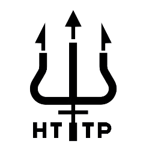

# TritonHTTP

TritonHTTP is a lightweight web server that implements a subset of the HTTP/1.1 protocol, specifically designed to handle GET requests. This project is a practical exploration of HTTP server functionalities, focusing on concurrency, request parsing, and response handling.

## Features

- Basic Web Server: Listens for connections and processes HTTP requests from clients.
- Persistent Connections: Supports reuse of TCP connections for improved efficiency.
- Request Handling: Properly parses and responds to HTTP GET requests.
- Error Responses: Implements appropriate HTTP status codes (200, 400, 404).
- Virtual Hosting: Supports multiple hostnames, mapping to unique directories.
- Timeout Mechanism: Closes connections after a configurable timeout period.

### Supported HTTP Headers

- **Request Headers**:
  - `Host` (required)
  - `Connection` (optional)
- **Response Headers**:
  - `Date`
  - `Last-Modified`
  - `Content-Type`
  - `Content-Length`
  - `Connection`

For detailed specification, refer to `docs/theory.pdf`.

## Setup

```bash
# Clone the repository
git clone https://github.com/mayank-02/tritonhttp.git
cd tritonhttp

# Install dependencies
go mod tidy

# Run tests
go test ./...

# Run the server
go run server.go

# Open your browser and navigate to `http://localhost:PORT`.
```

## Configuration

* Virtual Hosts: Define your host-to-directory mappings in virtual_hosts.yaml.
* Server Port: Modify the default port in the configuration section of main.go if needed.

## Testing

Automated tests are provided to verify server functionality:

```
go test -v
```


You can also use command-line tools like `curl` or `netcat` to test the server responses. Example:

```bash
curl -v http://localhost:PORT/path/to/resource
```

## Contributions

Contributions are welcome! Please fork the repository and submit a pull request for review.

## License

This project is licensed under the MIT License. See the [LICENSE](LICENSE) file for more details.
